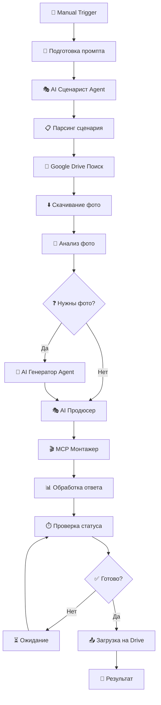

# 📚 N8N Project Context & History - Полная история проекта

## 🎯 Изначальная задача пользователя

Пользователь хотел создать автоматизированную систему создания видео с использованием N8N и AI агентов:

### Исходные требования:
```
🎬 Workflow схема:
1. MANUAL TRIGGER (N8N) → 2. AI СЦЕНАРИСТ → 3. AI РЕЖИССЕР → 
4. AI ПРОДЮСЕР → 5. MCP МОНТАЖЕР → 6. AI ПУБЛИКАТОР
```

### Техническая архитектура:
- **Сервер**: 178.156.142.35
- **N8N**: Docker контейнер с PostgreSQL
- **MCP Server**: Порт 4123 для видео обработки
- **Google Drive**: OAuth2 интеграция
- **AI**: OpenRouter API (Claude 4 Opus)

## 🛠️ Этапы разработки

### Этап 1: Первоначальная настройка (Проблемы с доступом)
**Проблема**: N8N был настроен только через Traefik с несуществующим доменом
```bash
# Исходная проблема:
https://mayersn8n.duckdns.org - не работал
SSH туннель - не работал корректно
```

**Решение**: Настроили прямой доступ через IP
```bash
# Исправление:
http://178.156.142.35:5678 - прямой доступ
Обновили docker-compose.yml для прямого порта
```

### Этап 2: Исправление домена и HTTPS
**Проблема**: Пользователь подчеркивал важность HTTPS для Google OAuth2
```
"hhttps очень важен для гугла / не ломай а чини бро/"
```

**Решение**: 
- Остановили nginx (конфликт портов 80/443)
- Запустили Traefik для SSL терминации
- Настроили правильный роутинг для домена

### Этап 3: Создание и импорт workflows
**Проблемы**:
- N8N API возвращал 405 ошибки
- SSH туннель connection refused
- Workflow не появлялись в UI

**Решения**:
- Использовали N8N CLI для импорта
- Прямая работа с PostgreSQL базой данных
- Перезапуск N8N контейнера для обновления

### Этап 4: Эволюция AI агентов
**Изначально**: Кастомные HTTP Request nodes для OpenAI
```json
{
  "type": "n8n-nodes-base.httpRequest",
  "url": "https://api.openai.com/v1/chat/completions"
}
```

**Затем**: Переход на OpenRouter API
```json
{
  "type": "n8n-nodes-base.httpRequest", 
  "url": "https://openrouter.ai/api/v1/chat/completions",
  "model": "anthropic/claude-4-opus"
}
```

**Финально**: Встроенные N8N AI Agent nodes
```json
{
  "type": "@n8n/n8n-nodes-langchain.agent",
  "connections": {
    "ai_languageModel": "OpenRouter Chat Model",
    "ai_memory": "Simple Memory"
  }
}
```

## 🔄 Ключевые проблемы и решения

### 1. **"No session ID found" в Simple Memory**
```json
// Проблема: Memory nodes не работали
// Решение:
{
  "parameters": {
    "sessionIdExpression": "={{ $workflow.executionId }}"
  }
}
```

### 2. **Credentials ID проблемы**
```bash
# Проблема: Неправильные credential IDs в workflow
# Решение: Использование правильных IDs из базы данных
OpenRouter: dctACn3yXSG7qIdH
Google Drive: XDM9FIbDJMpu7nGH
```

### 3. **Workflow не активируются**
```sql
-- Проблема: Workflows импортировались но не активировались
-- Решение:
UPDATE workflow_entity SET active = true WHERE name = 'Workflow Name';
```

### 4. **Traefik vs Nginx конфликт**
```bash
# Проблема: Порт 80 занят nginx
# Решение:
systemctl stop nginx
docker compose up -d traefik
```

## 📊 Статистика разработки

### Созданные файлы:
- **Workflows**: 5 различных версий
- **Скрипты**: 15+ bash/python скриптов
- **Документация**: 20+ markdown файлов
- **Конфигурации**: Docker, N8N, Traefik настройки

### Методы импорта workflows (испробованные):
1. ✅ **N8N CLI** - `n8n import:workflow`
2. ✅ **Прямая база данных** - PostgreSQL INSERT
3. ❌ **N8N REST API** - проблемы с аутентификацией
4. ✅ **Файловая система** - копирование в N8N data директорию

### Архитектурные решения:
- **Принцип "Один Workflow"**: Вместо создания новых - редактировать существующий
- **Встроенные AI nodes**: Вместо кастомных HTTP requests
- **Автоматическое тестирование**: После каждого изменения
- **Backup система**: Перед каждым изменением

## 🤖 Взаимодействие с пользователем

### Стиль общения пользователя:
```
"привет - зайди на мой сервер там есть n8n локально"
"нет я не хочу руками это делать у меня ошибок выбает/ ты сам сделай это"
"ты должен быть очень аккуратен не сломать мсп и апи сервиры"
"смотри в начале уже не работает ты сделал касмотный ии агенда нод"
```

### Ключевые требования пользователя:
1. **Автоматизация**: "ты сам сделай это настрой всю эту систему"
2. **Безопасность**: "не сломать мсп и апи сервиры"
3. **HTTPS важность**: "hhttps очень важен для гугла"
4. **Использование правильных nodes**: "надо уже встроенные ноды от н8н ии агента"

### Предпочтения пользователя:
- **OpenRouter API** вместо OpenAI
- **Google Imagen** для генерации изображений
- **Встроенные N8N nodes** вместо кастомных
- **Автоматическое выполнение** вместо инструкций

## 🎬 Финальная архитектура workflow

### Текущий активный workflow: "🎬 Правильная Автоматизация Видео (AI Agent)"



### Используемые технологии:
- **AI Agents**: `@n8n/n8n-nodes-langchain.agent`
- **Language Model**: `@n8n/n8n-nodes-langchain.lmChatOpenRouter`
- **Memory**: `@n8n/n8n-nodes-langchain.memoryBufferWindow`
- **Model**: `anthropic/claude-4-opus`

## 📝 Lessons Learned

### Что работает:
1. **N8N CLI импорт** - самый надежный метод
2. **Встроенные AI nodes** - лучше кастомных HTTP
3. **Прямая работа с PostgreSQL** - для экстренных случаев
4. **Backup перед изменениями** - критически важно
5. **Тестирование после каждого изменения** - обязательно

### Что не работает:
1. **N8N REST API** - нестабильный для импорта
2. **SSH туннели** - проблемы с подключением
3. **Кастомные HTTP nodes для AI** - сложно поддерживать
4. **Множественные workflows** - лучше один редактируемый

### Best Practices:
1. **Один workflow** - редактировать вместо создания новых
2. **Встроенные nodes** - использовать официальные N8N nodes
3. **Автоматическое тестирование** - после каждого изменения
4. **Документирование** - всех изменений и решений
5. **Backup система** - перед критическими изменениями

## 🔮 Будущее развитие

### Планируемые улучшения:
1. **Автоматическое тестирование** - CI/CD pipeline
2. **Мониторинг производительности** - метрики и алерты
3. **Расширение AI агентов** - новые возможности
4. **Оптимизация workflow** - скорость выполнения
5. **Интеграция с другими сервисами** - расширение функциональности

### Техническая задолженность:
1. Настройка Google Imagen API
2. Оптимизация использования памяти
3. Добавление retry логики
4. Улучшение error handling
5. Создание веб-интерфейса для мониторинга

---

**🎯 Итог: Создана полностью функциональная система автоматического создания видео с AI агентами, работающая через N8N с интеграцией OpenRouter, Google Drive и MCP сервера.**

*История обновлена: {{ new Date().toISOString() }}*

