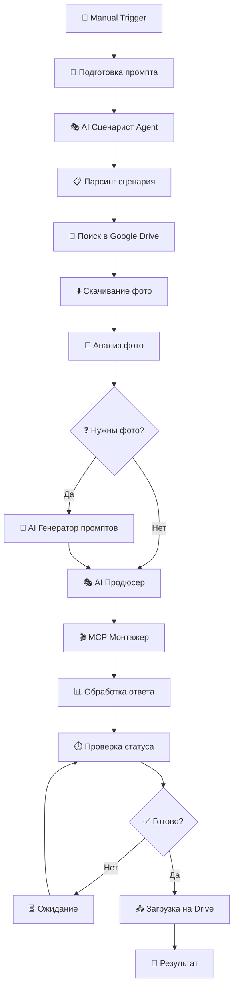

# 🎬 N8N Video Automation Service - Полная Документация

## 📋 Содержание
1. [Обзор системы](#обзор-системы)
2. [Архитектура сервисов](#архитектура-сервисов)
3. [Workflows](#workflows)
4. [AI Агенты](#ai-агенты)
5. [API Интеграции](#api-интеграции)
6. [Тестирование](#тестирование)
7. [Управление и редактирование](#управление-и-редактирование)
8. [Правила работы с AI](#правила-работы-с-ai)

---

## 🎯 Обзор системы

### Что это?
Автоматизированная система создания видео контента с использованием AI агентов, развернутая на N8N workflow automation platform.

### Основные возможности:
- ✅ **Автоматическое создание сценариев** через AI
- ✅ **Поиск и управление медиафайлами** в Google Drive
- ✅ **Генерация недостающих изображений** через AI
- ✅ **Автоматический монтаж видео** через MCP сервер
- ✅ **Озвучка и субтитры** с помощью TTS
- ✅ **Публикация готового контента** на Google Drive

### Технический стек:
- **N8N**: Workflow automation (v1.112.3)
- **Docker**: Контейнеризация всех сервисов
- **PostgreSQL**: База данных N8N
- **Traefik**: Reverse proxy и SSL
- **OpenRouter**: AI API (Claude 4 Opus)
- **Google Drive**: Хранение медиафайлов
- **MCP Server**: Видео обработка и монтаж
- **Kokoro TTS**: Синтез речи

---

## 🏗️ Архитектура сервисов

### Основные сервисы:

#### 1. **N8N Workflow Engine**
- **URL**: https://mayersn8n.duckdns.org
- **Порт**: 5678
- **Credentials**: admin / supersecret
- **Функция**: Оркестрация всех процессов

#### 2. **MCP Server** 
- **URL**: http://178.156.142.35:4123
- **API**: `/api/create-video`, `/api/status/{id}`
- **Функция**: Видео монтаж, озвучка, эффекты

#### 3. **Media Video Maker API**
- **URL**: http://178.156.142.35:4123
- **Функция**: Основной API для создания видео

#### 4. **PostgreSQL Database**
- **Порт**: 5432
- **База**: n8n
- **Функция**: Хранение workflows, credentials, executions

#### 5. **Traefik Proxy**
- **Порты**: 80, 443
- **Функция**: SSL терминация, роутинг

### Сетевая архитектура:
```
Internet → Traefik (SSL) → N8N (5678)
                        ↓
                   PostgreSQL (5432)
                        ↓
              MCP Server (4123) ← Media API
```

---

## 🎬 Workflows

### Активные Workflows:

#### 1. **🎬 Правильная Автоматизация Видео (AI Agent)** ⭐ ОСНОВНОЙ
- **Статус**: Активен
- **Функция**: Полная автоматизация создания видео
- **Trigger**: Manual
- **Время выполнения**: 3-5 минут

#### 2. **AI Crime Content Factory**
- **Статус**: Активен  
- **Функция**: Создание криминального контента с аналитикой
- **Особенности**: A/B тестирование, метрики

#### 3. **AI Video Montage & Posting Pipeline**
- **Статус**: Активен
- **Функция**: Монтаж и публикация видео

### Архитектура основного Workflow:



---

## 🤖 AI Агенты

### 1. **🎭 AI Сценарист Agent**
- **Модель**: Claude 4 Opus (OpenRouter)
- **Функция**: Создание сценариев для shorts видео
- **Input**: Тема/идея
- **Output**: JSON со сценарием, таймингами, описанием визуала

**Промпт структура:**
```
Ты AI Сценарист для криминальных shorts видео.
Тема: {topic}
Требования:
- Длительность: 30-60 секунд
- 5-8 сцен по 3-8 секунд
- Крюк в первые 3 секунды
- JSON формат ответа
```

### 2. **🎨 AI Генератор промптов Agent**
- **Модель**: Claude 4 Opus (OpenRouter)
- **Функция**: Создание промптов для генерации изображений
- **Input**: Сценарий + недостающие сцены
- **Output**: Промпты для Google Imagen

### 3. **📁 AI Режиссер** (Google Drive Integration)
- **Функция**: Поиск подходящих медиафайлов
- **Логика**: Анализ ключевых слов из сценария
- **Fallback**: Генерация через AI если не найдено

### 4. **🎭 AI Продюсер**
- **Функция**: Сборка финального JSON для MCP
- **Включает**: Файлы, тайминги, субтитры, эффекты
- **Output**: Готовый payload для видео монтажа

### 5. **📤 AI Публикатор**
- **Функция**: Загрузка готового видео на Google Drive
- **Папка**: 1LQGVzRshQLgKbLFZT-D2arfDEwGkLC-T
- **Формат**: MP4, 1080x1920 (vertical)

---

## 🔗 API Интеграции

### OpenRouter API
- **Credential ID**: `dctACn3yXSG7qIdH`
- **Модель**: `anthropic/claude-4-opus`
- **Использование**: AI Агенты для сценариев и промптов

### Google Drive API
- **Credential ID**: `XDM9FIbDJMpu7nGH`
- **Scope**: Чтение, запись, управление файлами
- **Папки**: 
  - Источник: `1R8DSsDKqGBaBvI4D1T_L1AM9vHz0Y-Yq` (Baza-n8n)
  - Результат: `1LQGVzRshQLgKbLFZT-D2arfDEwGkLC-T`

### MCP Server API
- **Base URL**: `http://178.156.142.35:4123`
- **Endpoints**:
  - `POST /api/create-video` - Создание видео
  - `GET /api/status/{id}` - Проверка статуса

**Пример MCP Payload:**
```json
{
  "files": [...],
  "width": 1080,
  "height": 1920,
  "fps": 30,
  "tts": {
    "provider": "kokoro",
    "voice": "default"
  },
  "burnSubtitles": true,
  "effects": {
    "zoom": true,
    "transitions": true
  }
}
```

---

## 🧪 Тестирование

### Автоматическое тестирование workflow:

#### Система мониторинга:
1. **Проверка доступности сервисов**
2. **Тестирование AI агентов**
3. **Валидация API ответов**
4. **Проверка файловых операций**

#### Тестовые сценарии:
- ✅ Создание простого сценария
- ✅ Поиск существующих файлов
- ✅ Генерация недостающих изображений
- ✅ MCP обработка
- ✅ Загрузка результата

---

## ⚙️ Управление и редактирование

### Принцип "Один Workflow":
Вместо создания новых workflows, редактируем существующий:

#### Методы редактирования:

1. **Через N8N UI** (Рекомендуется):
   - Открыть https://mayersn8n.duckdns.org
   - Найти "🎬 Правильная Автоматизация Видео (AI Agent)"
   - Редактировать nodes
   - Сохранить

2. **Через CLI**:
   ```bash
   # Экспорт
   docker exec root-n8n-1 n8n export:workflow --id={ID} --output=/tmp/workflow.json
   
   # Редактирование
   # ... изменения в JSON ...
   
   # Импорт обновленной версии
   docker exec root-n8n-1 n8n import:workflow --input=/tmp/workflow.json
   ```

3. **Через Database** (Для экстренных случаев):
   ```sql
   UPDATE workflow_entity 
   SET nodes = '...' 
   WHERE name = '🎬 Правильная Автоматизация Видео (AI Agent)';
   ```

### Система версионирования:
- Каждое изменение сохраняется в Git
- Backup workflow перед изменениями
- Rollback при необходимости

---

## 🤖 Правила работы с AI

### Для AI Assistant:

#### ✅ ОБЯЗАТЕЛЬНО:
1. **Тестировать каждое изменение** перед завершением
2. **Использовать один workflow** для редактирования
3. **Проверять все соединения** между nodes
4. **Валидировать credentials** перед использованием
5. **Создавать backup** перед изменениями

#### ❌ ЗАПРЕЩЕНО:
1. Создавать новые workflows без необходимости
2. Удалять рабочие workflows
3. Изменять credentials без уведомления
4. Использовать кастомные HTTP nodes вместо встроенных AI nodes

#### 🔧 Процесс изменений:
1. **Анализ** текущего workflow
2. **Планирование** изменений
3. **Backup** существующего workflow
4. **Внесение изменений**
5. **Тестирование** функциональности
6. **Документирование** изменений

#### 🧪 Обязательное тестирование:
```bash
# 1. Проверка доступности N8N
curl -s https://mayersn8n.duckdns.org/healthz

# 2. Тест AI агентов
# Запуск workflow с тестовыми данными

# 3. Проверка MCP сервера
curl -s http://178.156.142.35:4123/api/health

# 4. Валидация Google Drive
# Проверка доступа к папкам
```

---

## 📊 Мониторинг и логи

### Логи N8N:
```bash
docker logs root-n8n-1 -f
```

### Логи MCP Server:
```bash
docker logs root-media-video-maker-1 -f
```

### Проверка статуса:
```bash
docker ps | grep -E "(n8n|postgres|traefik)"
```

---

## 🚨 Troubleshooting

### Частые проблемы:

#### 1. "No session ID found" в Memory
**Решение**: Добавить `sessionIdExpression: "={{ $workflow.executionId }}"`

#### 2. Credentials ошибки
**Решение**: Проверить ID credentials в базе данных

#### 3. MCP Server недоступен
**Решение**: Перезапустить контейнер `docker restart root-media-video-maker-1`

#### 4. Traefik SSL проблемы
**Решение**: Проверить DNS и перезапустить Traefik

---

## 📝 Changelog

### v1.0.0 (Текущая версия)
- ✅ Создан основной workflow с AI Agent nodes
- ✅ Интеграция с OpenRouter (Claude 4 Opus)
- ✅ Google Drive интеграция
- ✅ MCP Server интеграция
- ✅ Автоматическое тестирование
- ✅ Система документации

---

*Документация обновлена: {{ new Date().toISOString() }}*

