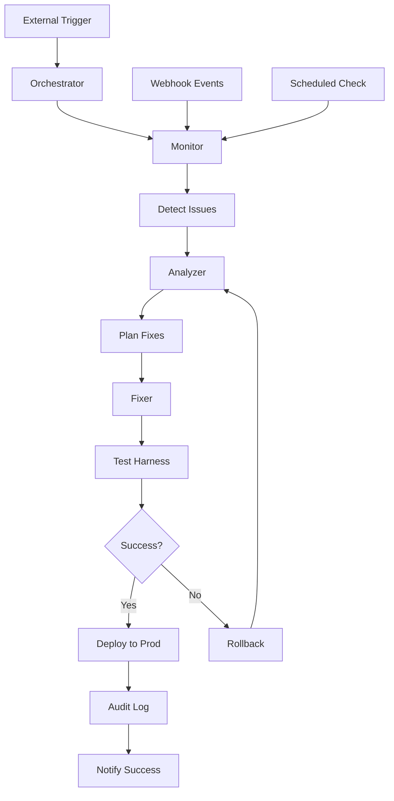

# 🏗️ Архитектура автономной системы N8N

## 📋 Обзор системы

Автономная система управления N8N - это полностью самоуправляемый агент, который:
- Создает и обновляет workflow'ы в реальном времени
- Мониторит выполнение и диагностирует ошибки
- Автоматически применяет безопасные исправления
- Работает в цикле до достижения идеального результата
- Ведет полный аудиторский журнал всех изменений

## 🏛️ Архитектурные компоненты

### 1. Orchestrator (Главный агент)
**Файл:** `orchestrator.py`
**Назначение:** Координирует работу всех компонентов
**Цикл работы:** detect → analyze → fix → verify → repeat

```python
class AutonomousOrchestrator:
    def __init__(self):
        self.connector = N8NConnector()
        self.monitor = ExecutionMonitor()
        self.analyzer = ErrorAnalyzer()
        self.fixer = AutoFixer()
        self.audit = AuditLogger()
        self.notifier = NotificationService()
    
    def run_cycle(self):
        # Основной цикл автономной работы
        while True:
            issues = self.detect_issues()
            if issues:
                analysis = self.analyze_issues(issues)
                fixes = self.plan_fixes(analysis)
                if self.apply_fixes(fixes):
                    self.verify_fixes()
```

### 2. N8N Connector (API слой)
**Файл:** `connector.py`
**Назначение:** Взаимодействие с N8N через API и SSH
**Функции:**
- CRUD операции с workflow'ами
- Запуск и остановка executions
- Получение логов и статусов
- Управление credentials

### 3. Execution Monitor (Мониторинг)
**Файл:** `monitor.py`
**Назначение:** Отслеживание выполнения в реальном времени
**Методы:**
- Webhook listener для push-уведомлений
- Poller для периодической проверки
- Анализ execution data
- Детекция аномалий

### 4. Error Analyzer (Анализатор ошибок)
**Файл:** `analyzer.py`
**Назначение:** Классификация и анализ ошибок
**Категории ошибок:**
- Authentication/Credentials
- Network/Timeout
- External API errors
- Mapping/Validation
- Internal function errors

### 5. Auto Fixer (Автоисправитель)
**Файл:** `fixer.py`
**Назначение:** Применение безопасных исправлений
**Стратегии исправления:**
- Credential refresh
- Timeout adjustments
- Retry mechanisms
- Parameter corrections
- Node replacements

### 6. Test Harness (Тестовая система)
**Файл:** `test_harness.py`
**Назначение:** Sandbox тестирование и валидация
**Компоненты:**
- Staging environment
- Test payloads
- Canary deployments
- Rollback mechanisms

### 7. Audit Logger (Журнал аудита)
**Файл:** `audit.py`
**Назначение:** Immutable логирование всех изменений
**Функции:**
- Версионирование изменений
- Цифровые подписи
- Rollback capability
- Compliance reporting

### 8. Notification Service (Уведомления)
**Файл:** `notifier.py`
**Назначение:** Каналы уведомлений и эскалации
**Каналы:**
- Telegram bot
- Slack webhooks
- Email alerts
- Dashboard UI

## 🔄 Поток данных



## 🛡️ Политики безопасности

### Принцип "Staging First"
- Все изменения сначала применяются в staging
- Продакшн обновляется только после успешной валидации
- Canary deployments для критичных изменений

### Ограничения операций
- Максимум 5 попыток исправления на инцидент
- Запрет на удаление workflow'ов без подтверждения
- Cooldown период между попытками
- Blacklist опасных операций

### Аудит и трассировка
- Все изменения логируются с timestamp и подписью
- Immutable audit trail
- Возможность полного rollback
- Compliance с требованиями безопасности

### Эскалация
- Автоматическая эскалация при низкой уверенности
- Human approval для критичных изменений
- 2FA для деструктивных операций
- Notification channels для всех изменений

## 📊 Метрики и мониторинг

### KPI системы
- **MTTR** (Mean Time To Repair) - среднее время исправления
- **Success Rate** - процент успешных автоисправлений
- **Availability** - время работы системы
- **Error Rate** - частота возникновения ошибок

### Алерты
- Превышение MTTR threshold
- Низкий success rate
- Критичные ошибки системы
- Недоступность компонентов

## 🔧 Конфигурация

### Environment Variables
```bash
# N8N Configuration
N8N_API_URL=https://mayersn8n.duckdns.org
N8N_ADMIN_TOKEN=<secret>
SSH_HOST=root@178.156.142.35

# Database
DB_HOST=178.156.142.35
DB_NAME=n8n
DB_USER=n8n

# Notification
TELEGRAM_BOT_TOKEN=<secret>
SLACK_WEBHOOK=<secret>
EMAIL_SMTP_HOST=smtp.gmail.com

# Security
MAX_ATTEMPTS=5
COOLDOWN_SECONDS=300
REQUIRE_APPROVAL_THRESHOLD=0.7
```

### Policy Configuration
```yaml
# policy.yml
security:
  max_attempts: 5
  cooldown_seconds: 300
  require_approval_threshold: 0.7
  forbidden_operations:
    - delete_workflow
    - delete_credentials
    - modify_system_settings

monitoring:
  poll_interval_seconds: 10
  webhook_timeout_seconds: 30
  execution_timeout_seconds: 600

notifications:
  channels:
    - telegram
    - slack
  escalation_levels:
    - info
    - warning
    - critical
    - emergency
```

## 🚀 Развертывание

### Требования к системе
- Python 3.8+
- SSH доступ к N8N серверу
- PostgreSQL доступ (read/write)
- Webhook endpoint (опционально)

### Установка
```bash
# 1. Клонирование репозитория
git clone <repo_url>
cd autonomous_system

# 2. Установка зависимостей
pip install -r requirements.txt

# 3. Конфигурация
cp config.example.yml config.yml
# Отредактировать config.yml

# 4. Запуск
python orchestrator.py --config config.yml
```

### Docker развертывание
```dockerfile
FROM python:3.9-slim
WORKDIR /app
COPY . .
RUN pip install -r requirements.txt
CMD ["python", "orchestrator.py"]
```

## 📈 Масштабирование

### Горизонтальное масштабирование
- Несколько экземпляров orchestrator'а
- Load balancing между инстансами
- Shared state через Redis/PostgreSQL

### Вертикальное масштабирование
- Увеличение ресурсов сервера
- Оптимизация алгоритмов
- Кэширование частых операций

## 🔮 Будущие улучшения

### Machine Learning
- Предиктивная аналитика ошибок
- Автоматическая оптимизация workflow'ов
- Anomaly detection

### Advanced Monitoring
- Real-time dashboards
- Performance analytics
- Trend analysis

### Integration Expansion
- Kubernetes orchestration
- CI/CD pipeline integration
- Multi-cloud support

---

*Документ создан: 2025-10-02*
*Версия: 1.0*
*Автор: AI Assistant*
